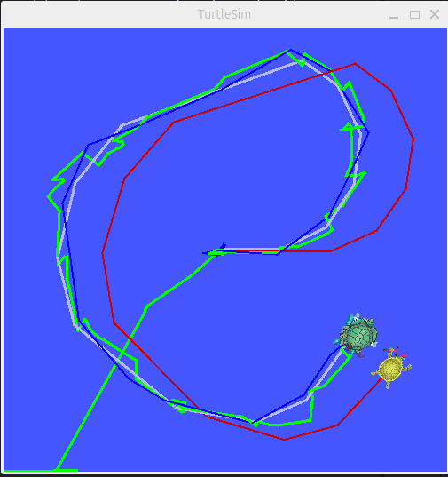
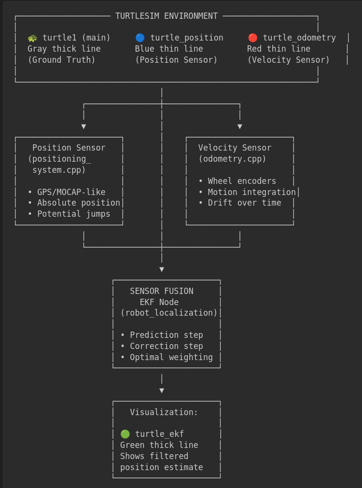

# ROS2 Robot Localization Turtle Demonstration

A ROS2 demonstration showing how Extended Kalman Filter (EKF) fuses positioning and odometry sensors to update state estimates using turtlesim visualization.

## Overview

This repository demonstrates sensor fusion principles using the `robot_localization` package's EKF implementation. It shows how multiple sensor inputs (position measurements and odometry) are combined to produce a more accurate state estimate than any single sensor alone.

<div align="center">
  <table>
    <tr>
      <td align="center" width="50%">
        
        <br/><i>Demo 4 turtles paths</i>
      </td>
      <td align="center" width="60%">
        
        <br/><i>Demo architecture</i>
      </td>
    </tr>
  </table>
</div>


## Packages

- **robot_localization_demo**: Custom demo package demonstrating sensor fusion concepts
- **robot_localization**: EKF/UKF implementation (references original repository at https://github.com/cra-ros-pkg/robot_localization)

## EKF Sensor Fusion Concept

The Extended Kalman Filter demonstrates:

1. **Prediction Step**: Uses odometry to predict robot motion based on velocity commands
2. **Correction Step**: Uses position measurements to correct accumulated drift
3. **Optimal Fusion**: Weights sensor inputs based on their uncertainty/covariance matrices
4. **Continuous Tracking**: Maintains smooth, accurate state estimates over time

## Getting Started

```bash
# Installation
git clone --recursive https://github.com/bingxue-xu/robp_localization.git

mkdir -p ~/localization_ws
mv robot_localization_demo ~/localization_ws/src

cd ~/localization_ws
rosdep install --from-paths src --ignore-src -r -y

colcon build --symlink-install

# Running demo
source install/setup.bash
ros2 launch robot_localization_demo localization_demo.launch.py
```

## Reference

- [robot_localization Documentation](http://docs.ros.org/en/latest/p/robot_localization/)
- [Extended Kalman Filter Theory](https://en.wikipedia.org/wiki/Extended_Kalman_filter)
- [ROS2 Jazzy Documentation](https://docs.ros.org/en/jazzy/)
- [TurtleSim Tutorials](https://docs.ros.org/en/jazzy/Tutorials/Beginner-CLI-Tools/Introducing-Turtlesim/Introducing-Turtlesim.html)
